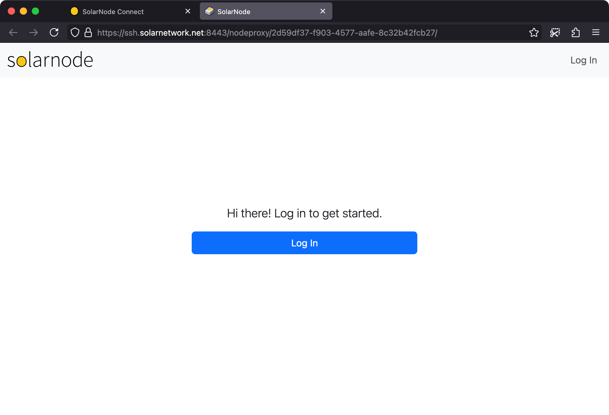

# SolarSSH Webterminal

This project contains a webapp that connects to a [SolarSSH][solarssh] server and initiates a
browser-based terminal session to a SolarNode.

Here's a demo of how this webapp can be used to establish a shell terminal on a SolarNode:


# Use

Fill in the node ID and SolarNetwork security credentials that have management permission,
then click the **Connect** button to start the SSH session. Once SolarNode has established
its connection to the session, the **CLI** and **GUI** buttons will become available.

## CLI

Click the **CLI** button to log into the node's operating system (command line). You will
be prompted to provide the OS username and password to authenticate as.

## GUI

Click the **GUI** button to open a new window to the SolarNode Management GUI, where you
will be able to login using SolarNode credentials.



# URL parameters

You can provide the following URL query parameters to customize the initial configuration:

| Parameter | Description                                          |
| :-------- | :--------------------------------------------------- |
| `nodeId`  | The node ID to fill in the form with.                |
| `lines`   | The number of lines to display in the terminal pane. |

For example, to control node ID 123 with a 48-line high terminal, you'd use URL query parameters like:

```
?nodeId=123&lines=48
```

# Building from source

To build yourself, clone or download this repository. You need to have
Node 20.19+ installed. Then:

```sh
# initialize dependencies
npm ci

# run development live server on http://localhost:8080
npm run dev

# build for production
npm run build
```

Running the `build` script will generate the application into the `dist/` directory.

[npm]: https://www.npmjs.com/
[solarssh]: https://github.com/SolarNetwork/solarnetwork/wiki/SolarSSH-Guide
